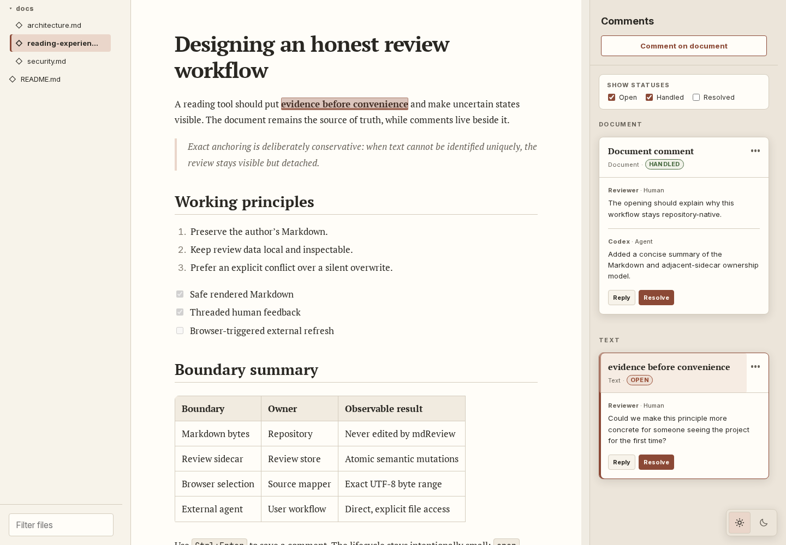

# mdReview

mdReview is a local terminal application for Linux and Apple Silicon macOS to review Markdown
documents that coding agents make.

Use mdReview when an agent makes a plan, a specification, or another Markdown document. Read the
document in a browser. Add a comment to the document or to selected text.

mdReview saves comments in a sidecar file next to the Markdown file:

```text
plan.md
plan.md.review.json
```

You can give the sidecar file to a coding agent after you complete review. The agent can read the
comments and change the Markdown file. mdReview does not change Markdown files. It does not start an
agent. It does not send comments to an agent.

mdReview also includes an optional Agent Skill. Install the skill to tell a coding agent where to
find sidecar comments and how to use them. You choose if and when to install the skill.



mdReview supports Linux on `amd64` and macOS on Apple silicon (`arm64`). It does not support Windows
or Intel Mac computers.

## Use mdReview to

- Review a Markdown document that a coding agent makes.
- Add comments to a document or to selected text.
- Save comments with the Markdown file.
- Give clear review data to a coding agent.

## Install

Open the [GitHub Releases page](https://github.com/WillEtheridge/md-review/releases). Download the
archive for your operating system:

| Operating system | Archive                                                |
| ---------------- | ------------------------------------------------------ |
| Linux `amd64`    | `mdreview-v0.1.0-linux-amd64.tar.gz`                   |
| macOS `arm64`    | `mdreview-v0.2.0-preview.1-darwin-arm64.tar.gz`        |

### Install on Linux

Run these commands from the directory that contains the downloaded archive:

```bash
tar -xzf mdreview-v0.1.0-linux-amd64.tar.gz
mkdir -p "$HOME/.local/bin"
install -m 0755 \
  mdreview-v0.1.0-linux-amd64/mdreview \
  "$HOME/.local/bin/mdreview"
"$HOME/.local/bin/mdreview" --version
```

If Bash cannot find `mdreview`, add the local binary directory to `PATH`:

```bash
printf '\nexport PATH="$HOME/.local/bin:$PATH"\n' >>"$HOME/.bashrc"
source "$HOME/.bashrc"
```

### Install on Apple silicon macOS

Confirm that the Mac uses Apple silicon:

```bash
uname -m
```

Continue only if the command prints `arm64`.

Run these commands from the directory that contains the downloaded archive:

```bash
tar -xzf mdreview-v0.2.0-preview.1-darwin-arm64.tar.gz
mkdir -p "$HOME/.local/bin"
install -m 0755 \
  mdreview-v0.2.0-preview.1-darwin-arm64/mdreview \
  "$HOME/.local/bin/mdreview"
printf '\nexport PATH="$HOME/.local/bin:$PATH"\n' >>"$HOME/.zprofile"
source "$HOME/.zprofile"
mdreview --version
```

The macOS archive is not signed or notarised. If macOS blocks the first start:

1. Open **System Settings**.
2. Select **Privacy & Security**.
3. Find the message about `mdreview`.
4. Select **Open Anyway**.
5. Start `mdreview` again.

### Install the optional Agent Skill

Install the Agent Skill if you want Codex, Pi, or Claude Code to find and address review comments.
mdReview works without the skill. Skill installation is global for your user account on Linux and
macOS.

For interactive installation, run:

```bash
mdreview setup
```

Use the Up and Down keys to move. Press Space to select or clear an agent. Press Enter to install the
skill for the selected agents. Your selection authorises installation or replacement of those
global skill files.

For direct installation, select each target that you use:

```bash
mdreview skill install --target codex
mdreview skill install --target claude
mdreview skill install --target pi
```

See [Manage the Agent Skill](#manage-the-agent-skill) for status, file locations, and removal.

## Update

Stop each running mdReview process with `Ctrl+C`. Download the new archive for your operating
system. Extract the archive and repeat the installation steps for your operating system. The
`install` command replaces the old binary.

Your Markdown and adjacent review sidecars stay in your project directory, so an update does not
migrate or alter your review data.

## Build from source

Building requires exactly Go 1.26.5, Node.js 26.2.0, and npm 11.13.0. Dependency installation may
use the network; the resulting application has no Node.js runtime dependency.

From an extracted source release, install the dependencies and build the browser files:

```bash
npm --prefix web ci
npm --prefix web run build
mkdir -p build
```

On Linux `amd64`, build the Linux binary:

```bash
GOTOOLCHAIN=local GOWORK=off GOENV=off \
  CGO_ENABLED=0 GOOS=linux GOARCH=amd64 GOAMD64=v1 \
  go build -mod=readonly -trimpath -buildvcs=false -ldflags=-buildid= \
  -o build/mdreview ./cmd/mdreview
```

On Apple silicon macOS, build the macOS binary:

```bash
GOTOOLCHAIN=local GOWORK=off GOENV=off \
  CGO_ENABLED=0 GOOS=darwin GOARCH=arm64 \
  go build -mod=readonly -trimpath -buildvcs=false -ldflags=-buildid= \
  -o build/mdreview ./cmd/mdreview
```

To make the Apple silicon macOS archive on Linux, run:

```bash
PATH="/path/to/go1.26.5/bin:$PATH" ./scripts/package-macos-preview.sh
```

The release process uses a pinned environment. A local build is not a release artifact unless it
has the published checksum.

## Use it

Run mdReview in the directory containing the Markdown you want to review:

```bash
cd /path/to/project
mdreview .
```

It runs in the foreground, binds only to `127.0.0.1`, and prints the canonical directory, discovered
document count, and a local URL:

```text
mdReview

Directory: /path/to/project
Documents: 14
URL:       http://127.0.0.1:4242/

Waiting for a browser connection. Press Ctrl+C to stop.
```

mdReview does not open a browser. Open the printed URL yourself. Press `Ctrl+C` in the terminal to
stop the application. mdReview has no daemon, tray application, or separate stop command. The
terminal or agent that launches the foreground process is responsible for stopping it.

Then:

1. Choose a Markdown file from the left-hand file tree.
2. Select text in the document, or use the document-level comment action.
3. Write a comment, reply in a thread, and resolve it when the review is done.
4. Commit or share the adjacent `.md.review.json` sidecar when you want the feedback to travel with
   the document.

With no directory argument, mdReview serves the current directory. It first tries port `4242`, then
reports another available port if needed:

```bash
mdreview
mdreview /path/to/project
mdreview --port 4800 /path/to/project
```

An explicit busy port is an error. Every invocation is independent. Different directories, or the
same directory, can run in separate foreground processes on different ports. Concurrent instances
still use revision checks and atomic sidecar replacement, but they are not a lossless multi-writer
system.

Use `mdreview --version` to confirm the installed release. The v0.1 CLI has no public `--help` flag;
use the command reference below for supported commands.

## Review a document

The interface has three fixed, independently scrolling panes:

1. **Files** discovers `.md` files recursively, respects `.gitignore`, and filters by filename.
2. **Document** renders sanitised GitHub-Flavoured Markdown with editorial typography.
3. **Review** holds document comments, text comments, replies, and status controls.

Choose Light, Dark, or System theme. The layout is desktop-only and remains fixed at narrow widths,
where the page scrolls horizontally.

To leave feedback:

1. Select a contiguous representable text range and choose **Comment**, or use **Add document
   comment**.
2. Write the comment. `Cmd+Enter` or `Ctrl+Enter` submits it and `Escape` cancels.
3. Use a thread to reply, edit a human message, resolve or reopen feedback, or delete a thread that
   has no replies.

Text selections can cross paragraphs. mdReview offers the Comment action only when both boundaries
map unambiguously to exact Markdown source bytes. Resolved threads are hidden by default and remain
available through the filter.

The browser polls once per second while its tab is active. It notices added, changed, removed, and
renamed documents and sidecars without a background filesystem watcher. With no active browser
request, the service does not scan. If the active document changes while a comment draft exists,
mdReview keeps the draft and asks you to finish or discard it before reloading.

## Sidecars and agent handoff

The first submitted thread creates a sidecar beside its document:

```text
guide.md
guide.md.review.json
```

Removing only the trailing `.review.json` pairs a sidecar with its Markdown file. Sidecars are
UTF-8, pretty-printed, schema-version-1 JSON. The published shape is documented by
[schema/review-v1.schema.json](schema/review-v1.schema.json).

Threads have two independent properties:

- status is `open`, `handled`, or `resolved`;
- a text anchor is currently attached or detached.

Text anchors retain immutable original evidence: an exact half-open UTF-8 byte range, its exact
Markdown source, and the visible selected text. On reload, mdReview attaches at the original range
if it still matches, otherwise at one exact unique occurrence. No occurrence or several occurrences
makes the thread detached. It does not guess with fuzzy or semantic matching.

When you ask a coding agent to address feedback, the intended grammar is:

1. Find the relevant `*.md.review.json` sidecars and read `open` threads.
2. Inspect and edit the paired Markdown directly.
3. Leave unclear or incomplete threads `open`.
4. For each completed change, append an `agent` message explaining what changed, then set that
   thread to `handled`.
5. Preserve anchors, unrelated threads, and unknown schema-version-1 values.
6. Never have an agent set a thread to `resolved`.
7. Review the result in mdReview and resolve it yourself when accepted.

The sidecar is the complete agent integration surface. There is no mdReview comment API, MCP server,
automatic comment delivery, or automatic model invocation.

## Manage the Agent Skill

The Agent Skill contains the review workflow above.

Run interactive setup again to install a missing skill or replace an installed skill:

```bash
mdreview setup
```

For direct management, select every target explicitly:

```bash
mdreview skill status
mdreview skill install --target codex
mdreview skill install --target claude
mdreview skill install --target pi
mdreview skill uninstall --target codex --target claude --target pi
```

Valid targets are `codex`, `claude`, and `pi`. Installation is global to the current user, not local
to the current repository. An explicit install command authorises replacement of that target's
`SKILL.md`. Interactive setup uses the selected agents.

The installed host entries are:

| Target      | Global user file                                   |
| ----------- | -------------------------------------------------- |
| Codex       | `$HOME/.codex/skills/mdreview/SKILL.md`            |
| Claude Code | `$HOME/.claude/skills/mdreview/SKILL.md`           |
| Pi          | `$HOME/.pi/agent/skills/mdreview/SKILL.md`         |

Each target has a separate file. Status reports installed or not installed. Uninstall removes
`SKILL.md`, then removes the `mdreview` directory only when it is empty; unrelated files are
preserved. Symlinked or malformed target layouts are refused. There is no canonical copy, link,
hash, ownership record, backup, `--force`, lock, or recovery state.

The skill describes mdReview as an ordinary foreground child process. The terminal or agent host
that launches it owns and stops it.

## Security and privacy

mdReview is a local tool, not a sandbox or remote collaboration server. It serves a normal loopback
URL with no access token.

Workspace access uses one portable Go path implementation on Linux and macOS. It rejects traversal,
symlinked paths, special files, and oversized reads. Browser writes are limited to the sidecar
derived from an indexed Markdown document; mdReview never writes Markdown or a client-supplied
arbitrary path. Markdown, sidecars, image files, browser requests, and ignore files are untrusted.

The workspace root is an application boundary under an ordinarily stable local namespace, not a
kernel capability sandbox. mdReview does not defend against another process running as the same user
that deliberately replaces a checked path component before access; that process can already read
and modify the repository.

Exact loopback binding and `Host` validation prevent remote and DNS-rebinding access. Browser writes
additionally require the exact same origin and JSON. Any local process or user able to connect to
the loopback port can read the API, and local software can forge browser headers, so all users and
processes on the machine are inside mdReview's network trust boundary. Do not expose mdReview through a
reverse proxy or use it on an untrusted shared machine.

Browser sidecar mutations are semantic, bounded, and atomic. A direct external writer, including an
agent, does not share mdReview's final transaction. An external replacement can still race between
mdReview's last revision check and its rename, so simultaneous browser/agent editing is not lossless
or race-free. Finish reviewing before asking an agent to edit, then reload and verify the result.
mdReview syncs and closes a complete temporary sibling before atomic rename, but does not promise
survival across sudden power loss or operating-system failure.

The release embeds its browser assets and makes no telemetry, analytics, remote-font, or
remote-content requests during ordinary use. Installing source dependencies and following a
user-opened external link may use the network. See [SECURITY.md](SECURITY.md) for the complete
boundary and reporting process.

## Limits

| Input or resource                                |                  current limit |
| ------------------------------------------------ | ----------------------------: |
| Markdown document                                |                         8 MiB |
| Review sidecar                                   |                         8 MiB |
| Relative image asset                             |                        20 MiB |
| Retained image blobs per active document and tab | 40 MiB, four concurrent loads |
| Mutation request body                            |                         2 MiB |
| Review message body                              |                  64 KiB UTF-8 |
| New text-anchor source                           |                   1 MiB UTF-8 |
| One `.gitignore` file                            |                         1 MiB |

Relative PNG, JPEG, GIF, and WebP images are loaded through the validated asset path. Active SVG and
unsupported image types are rejected. The encoded image budget does not claim to bound
browser-internal decoded image memory.

## Troubleshooting

- **No browser opened:** this is expected. Copy the complete printed URL into your browser.
- **Port 4242 was not used:** another process owns it, so mdReview selected and printed an available
  port. An explicit `--port` never falls back.
- **Another instance is already running:** this is allowed. Each invocation prints its own URL and
  must be stopped separately.
- **No documents appear:** only `.md` files are discovered. Check the served directory and
  applicable `.gitignore` rules.
- **A file is listed but will not open:** invalid UTF-8 and Markdown over 8 MiB are visible but
  cannot be rendered or reviewed.
- **The review pane is read-only:** inspect the reported invalid, duplicate, unsupported-version,
  unsafe, or over-8-MiB sidecar. mdReview does not repair or overwrite it.
- **A thread is detached:** its original exact source is now missing or occurs more than once. This
  is honest review history, not data loss.
- **A document changed while composing:** finish or discard the draft to load the current file.
- **`mdreview setup` requires an interactive terminal:** run setup in a terminal. Use direct
  `skill install` commands with explicit targets in a script.
- **Skill installation reports an unsafe layout:** replace the symlinked or malformed target
  directory yourself, then retry.
- **The process should stop:** return to its terminal and press `Ctrl+C`. mdReview intentionally has no
  daemon or remote stop command.

## Uninstall

First remove any global Agent Skill entries you installed:

```bash
mdreview skill uninstall --target codex --target claude --target pi
mdreview skill status
```

Then remove the binary from the path where you installed it:

```bash
rm -- "$HOME/.local/bin/mdreview"
```

The application does not create a database. Review sidecars are project data and are not deleted by
uninstalling mdReview.

## Licence and security

- [Security policy](SECURITY.md)
- [Third-party notices](THIRD_PARTY_NOTICES.md)
- [MIT licence](LICENSE)
